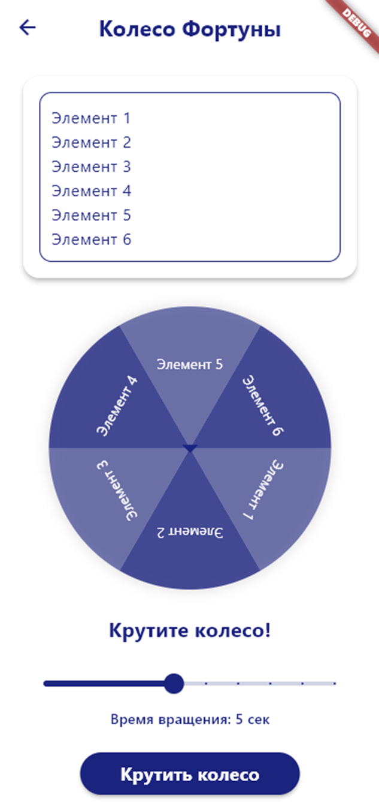

# Колесо Фортуны 🎡

Мобильное приложение "Колесо Фортуны" - это интерактивный инструмент для принятия случайных решений или проведения розыгрышей, разработанный с использованием Flutter.



## 🎯 Основные возможности

- Интерактивное колесо с 6 секторами
- Настраиваемые элементы для каждого сектора
- Анимация вращения колеса
- Регулируемое время вращения (по умолчанию 5 секунд)
- Стильный минималистичный дизайн в синих тонах
- Удобный пользовательский интерфейс

## 🚀 Технологии

- Flutter
- Dart
- Анимации Flutter
- Material Design

## 🛠 Установка и запуск

1. Клонируйте репозиторий:
```bash
git clone [ссылка на ваш репозиторий]
```

2. Перейдите в директорию проекта:
```bash
cd fortune_app
```

3. Установите зависимости:
```bash
flutter pub get
```

4. Запустите приложение:
```bash
flutter run
```

---

Разработано в рамках обучения Flutter
